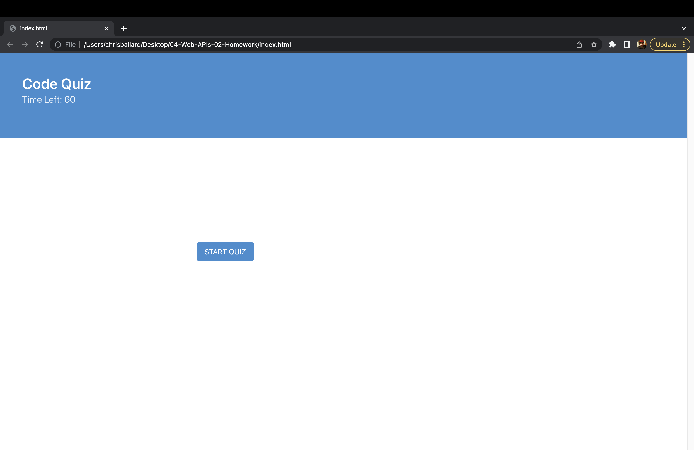
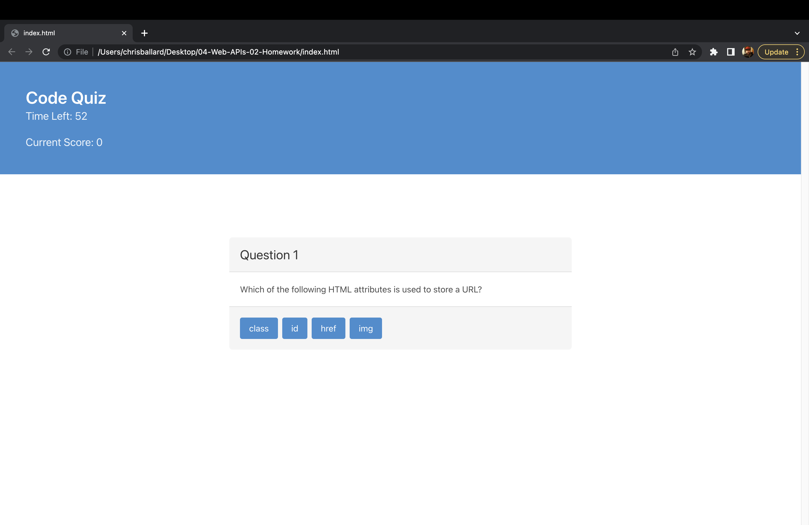
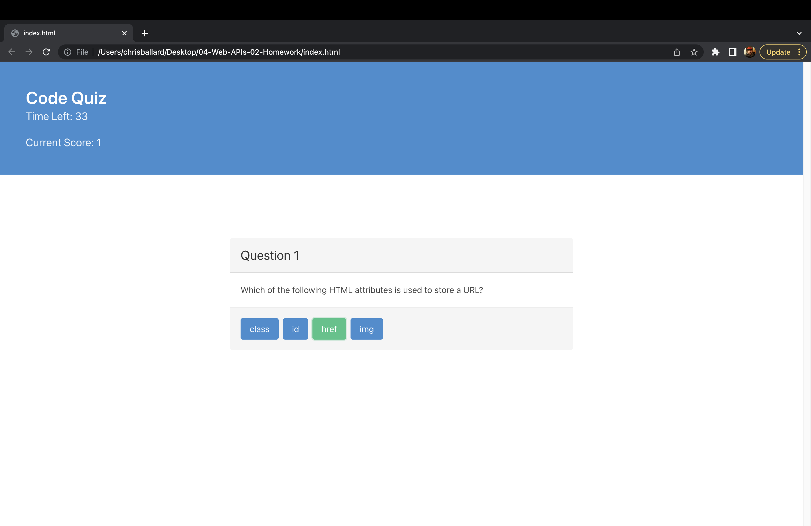
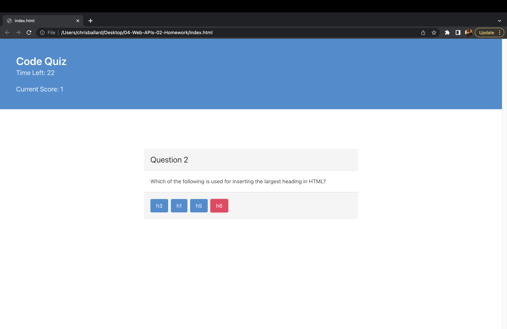
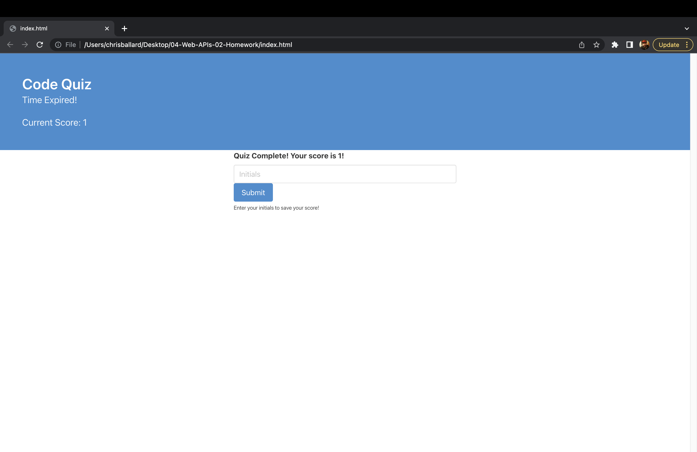

# Coding Quiz

## Description

This application is an example of a timed coding skills quiz. The user will be presented with a series of multiple choice questions and correct responses will be tallied in a score counter. Incorrect responses will result in a 10 second deduction from the timer.

## Table of Contents

- [Installation](#installation)
- [Usage](#usage)
- [Credits](#credits)
- [License](#license)
- [Tests](#tests)
- [Questions](#questions)

## Installation

This application is web-based and no installation is necessary.

## Usage

On page load, the user will be prompted to start the quiz by clicking on the button labeled "Start Quiz." At this time, the timer will be begin to count down from 60 seconds and the first question will appear. Correct results will result in the selected answer turning green while incorrect results will cause the selected answer to turn red. Correct answers will be tallied in the header next to the field titled "Current Score." incorrect responses will result in a deduction of 10 seconds from the timer. Regardless of whther the selected answer is correct, the user will immediately be shown the next question. This will proceed through the 5 multiple choice questions or until time runs out. At this point, the user will be informed of their score and will be prompted to enter their initials so that the score may be saved.

https://ballardcryan.github.io/04-Web-APIs-02-Homework/

## Credits

This application was developed by Chris Ballard using HTML5, Bulma CSS framework, and JavaScript

## License

No license informationhas been provided

## Tests

No application tests have been provided at this time.

## Questions

Github username: ballardcryan

Github URL: https://github.com/ballardcryan

Email: ballardcryan@gmail.com